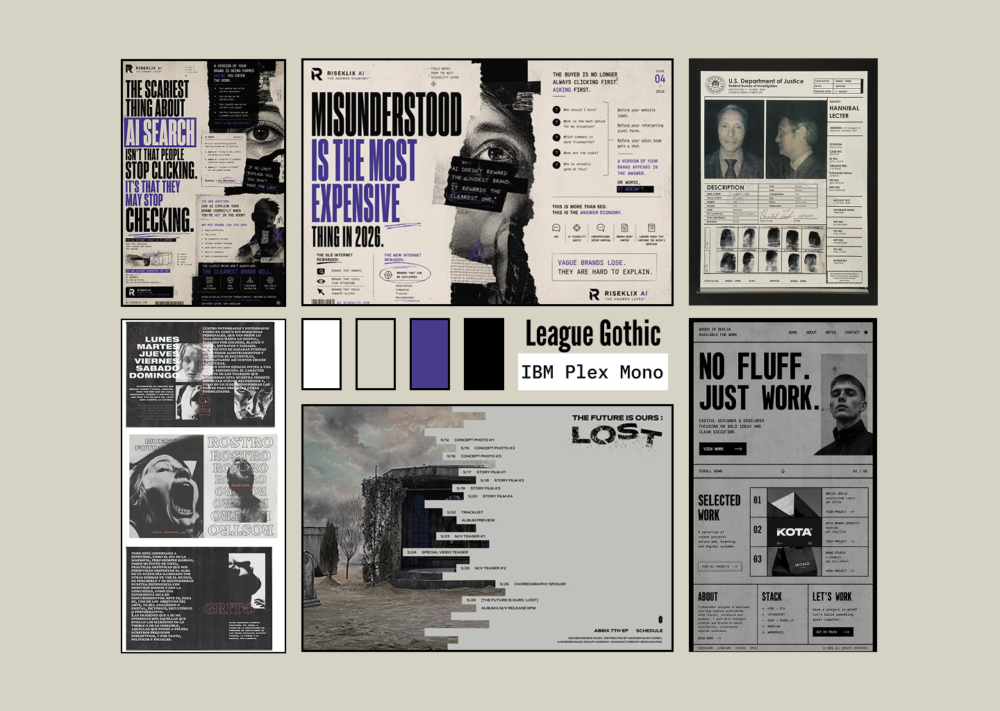
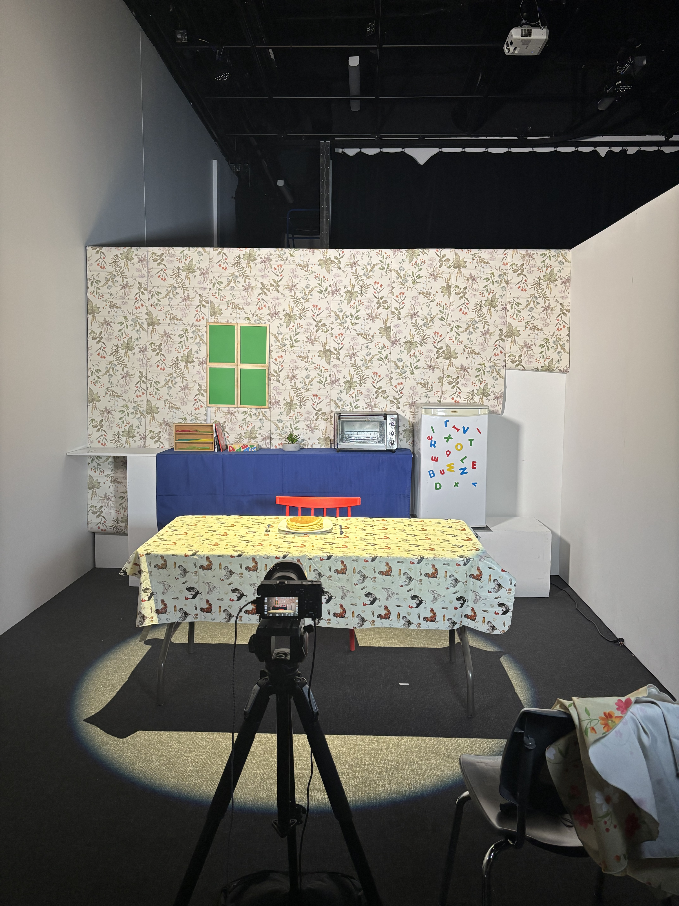
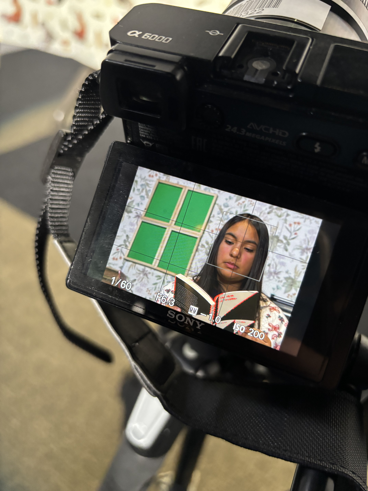
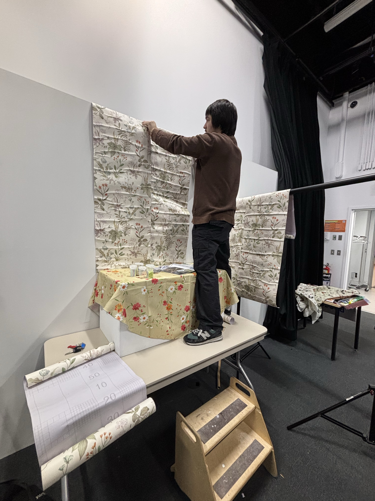

# Luiz Felippe Sousa

**felippetm21@gmail.com**

# Planification de Portfolio

## Identité visuelle

## Compétences

- Création d'expériences immersives et interactives
- Réalisation et tournage de vidéos
- Conception et création d'univers sonore et musical
- Animation 2D et 3D
- Programmation Web

## Logiciels

- DaVinci Resolve
- Maya/Blender
- Photoshop
- Reaper/FL Studio/Ableton
- Max
- Unity
- TouchDesigner

## Langage de programmation

- HTML
- CSS
- JavaScript

## Objectif de carrière

Mettre en valeur ma créativité et mes idées à travers des créations multimédias qui mettent à l'épreuve mes compétences. Évoluer dans le milieu en réalisant des projets qui cherchent à se démarquer et à s'améliorer sans cesse.

---

# Projets réalisés

## Projet 1

### Antrum

**Nom de votre projet :** Antrum  
**Mention académique ou personnelle :** Académique  
**Réalisé dans le cadre du cours :** Vidéo 2  
**Individuel ou en équipe :** Équipe  
**Nom de vos coéquipiers :** Mateo Rodriguez Fontaine, Pablo Pereira  
**Votre ou vos rôle(s) dans le projet :** Générale : Concepteur/artiste son, monteur, cameraman, éclairagiste.  
**Logiciels ou techniques utilisés :** Stop-motion avec Dragonframe, montage avec DaVinci Resolve, conception sonore avec FL Studio  
**Catégorie du projet :** Court métrage vidéo.

#### Description courte du projet

Court métrage d'horreur de style analog/found footage réalisé en vidéo et stop-motion, projeté dans une installation sur 4 écrans.

#### Description du projet (Demandes du prof)

Un projet vidéo en stop-motion dans une installation à 4 écrans et avec un jeu de lumières. Les 4 vidéos devaient se compléter entre elles pour réaliser un grand projet diffusé de manière inhabituelle.

#### Description du projet (Qu'est-ce que vous avez fait?)

Dans ce projet, on a créé un décor de toutes pièces, on s'est servi d'une caméra accompagnée d'un logiciel de stop-motion, on a fait du montage vidéo sur DaVinci Resolve et du montage sonore approfondi pour accompagner la vidéo. L'usage du micro pour capturer une voix et l'éclairage était aussi une partie essentielle du projet.

---

## Projet 2

### Le touché de la mort

**Nom de votre projet :** Le touché de la mort  
**Mention académique ou personnelle :** Académique  
**Réalisé dans le cadre du cours :** Vidéo 2  
**Individuel ou en équipe :** Équipe  
**Nom de vos coéquipiers :** Pablo Pereira, Stanley Vital  
**Votre ou vos rôle(s) dans le projet :** Cameraman, monteur, concepteur audio.  
**Logiciels ou techniques utilisés :** DaVinci Resolve  
**Catégorie du projet :** Court métrage vidéo

#### Description courte du projet

Court métrage vidéo de style horreur réalisé avec un objectif macro.

#### Description du projet

Réaliser un court projet dans le thème du corps avec une caméra équipée d'un objectif macro.

#### Description du projet (Qu'est-ce que vous avez fait?)

Pour ce projet, j'ai passé beaucoup de temps derrière la caméra, j'ai effectué une partie du montage et le son est entièrement réalisé par moi.

---

## Projet 3

### AM/FM

**Nom de votre projet :** AM/FM  
**Mention académique ou personnelle :** Académique  
**Réalisé dans le cadre du cours :** Audio 2, Animation 3D, traitement audiovisuel  
**Individuel ou en équipe :** Individuel  
**Votre ou vos rôle(s) dans le projet :** Directeur artistique, animateur, monteur, concepteur audio  
**Logiciels ou techniques utilisés :** Max, Reaper, Maya, DaVinci Resolve, TouchDesigner  
**Catégorie du projet :** Expérience interactive

#### Description courte du projet

Création d'un environnement audiovisuel interactif.

#### Description du projet

Créer un environnement et un univers sonore et visuel qui puissent être modifiés en temps réel.

#### Description du projet (Qu'est-ce que vous avez fait?)

Pour ce projet, j'ai appris à travailler avec le logiciel Max pour créer un univers sonore avec des sons que j'ai créés/trouvés et modifiés sur Reaper. J'ai créé un environnement 3D et j'ai animé, monté et modifié avec des effets visuels sur TouchDesigner.

---

## Projet 4

### 5685 11ème Avenue

**Nom de votre projet :** 5685 11ème Avenue  
**Mention académique ou personnelle :** Académique  
**Réalisé dans le cadre du cours :** Réalité Mixte  
**Individuel ou en équipe :** Équipe  
**Nom de vos coéquipiers :** Mateo Rodriguez Fontaine, Pablo Pereira  
**Votre ou vos rôle(s) dans le projet :** Générale : Concepteur/artiste son, programmeur, scénariste  
**Logiciels ou techniques utilisés :** Unity, Maya, VS Code  
**Catégorie du projet :** Court métrage vidéo.

#### Description courte du projet

Création d'un jeu VR sur Unity.

#### Description du projet

Réaliser un niveau d'un jeu en réalité virtuelle fait de A à Z.

#### Description du projet (Qu'est-ce que vous avez fait?)

Nous avons créé un niveau de jeu d'horreur en réalité virtuelle qui permettait au joueur de se déplacer, d'interagir et de progresser dans l'univers.

---

## Processus de création

Mon projet **Antrum** a débuté après une session de brainstorming avec mon équipe. Nous voulions créer une œuvre originale inspirée par le genre « analog horror » et l'œuvre *Don't Hug Me I'm Scared* : un univers inquiétant qui se cachait derrière une présentation « innocente ».

Notre défi principal était de créer un contraste cohérent entre nos séquences stop-motion et notre séquence vidéo normale qui puisse générer la peur. On a jumelé un style VHS avec le genre du « found footage » pour créer un tout cohérent et inquiétant.

Notre décor était notamment très important. Nous avons créé de toutes pièces un décor avec les ressources à notre disposition afin de créer notre ambiance et notre univers.

On a fini par faire un travail énorme au niveau de ce qu'on voulait raconter. On a réfléchi aux moindres détails de chaque scène, plan et élément du décor. On a organisé notre tournage sur trois jours. Tout était préparé parfaitement d'avance, ce qui a fait que notre tournage s'est déroulé de manière fluide, mais aussi efficace.

